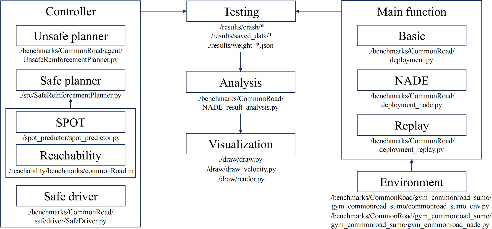

# Comparison of Dense Learning and Provably Safe Reinforcement Learning for Autonomous Driving

## Table of Contents:
1. [Introduction of the Project](#Introduction-of-the-Project)
   - [Overview](#overview)
   - [Code Structure](#code-structure)
2. [System Requirements](#system-requirements)
    - [Hardware](#hardware)
    - [Software](#software)
3. [Getting Started](#getting-started)
   - [Installation](docs/installation.md)
   - [Code Introduction](docs/code.md)
   - [Evaluation](docs/evaluation.md)
   - [Visualization](docs/visualization.md)
4. [License](#license)

## Introduction of the Project

### Overview
There exists a research community which develops provably safe reinforcement learning to improve the safety performance of autonomous vehicles (AVs). In this project, we aim to comprehensively evaluate the safety performance of one selected provably safe reinforcement learning model (see https://ieeexplore.ieee.org/abstract/document/10068193) using the naturalistic and adversarial driving environment (NADE). Then, we compare it with our SafeDriver and verify the effectiveness of the Dense Learning algorithm in improving the safety performance of AVs. 

Specifically, we integrated the CommonRoad software with NADE using the CommonRoad-SUMO interface. All the background vehicles (BVs) in the SUMO simulation will be managed by NADE. The simulation data of BVs will be converted into CommonRoad scenario objects and then transmitted to the provably safe reinforcement learning model to determine the required control inputs. The CommonRoad software will handle the simulation of the ego vehicle based on these control inputs and the system dynamics model. The CommonRoad-SUMO interface ensures the synchronization of the states of all traffic participants between the SUMO and CommonRoad simulations.

The provably safe reinforcement learning model consists of a base model developed via reinforcement learning and a safety shield. The safety performances of the base model, the provably safe reinforcement learning model, and the base model enhanced with SafeDriver were assessed. During the evaluation of the provably safe reinforcement learning model, the safety shield occasionally fails to find feasible solutions in safety-critical scenarios, with an infeasibility rate as high as $1.75 \times 10^{−2}$. In the original implementation, the testing episode would terminate upon encountering such situations, which is inadequate for thoroughly evaluating the safety performance of the motion planner. To make a fair comparison, we have implemented that the base model takes control if the safety shield is unable to find a feasible solution. Among these three AV planning modules, the base model with SafeDriver demonstrated the lowest crash rate in NDE at $2.22 \times 10^{−4}$. This represents a 96.1% reduction compared to the base model and a 49.1% decrease compared to the base model with a safety shield. 

### Code Structure
The code structure is shown in the following diagram.

## System Requirements

### Hardware
This code can run on a computer with the following hardware configuration:
- RAM: 32+ GB
- CPU: 8+ cores, 3.0+ GHz/core

It is highly recommended to run this code on a High-Performance Computing (HPC) cluster to reduce the time for data collection and training.

### Software
This code is developed and tested under
- Ubuntu 18.04 operating system
- Python 3.8.10

## Getting Started
- [Installation](docs/installation.md)
- [Code Introduction](docs/code.md)
- [Evaluation](docs/evaluation.md)
- [Visualization](docs/visualization.md)

## License
This code is licensed under the [PolyForm Noncommercial License 1.0.0](LICENSE).