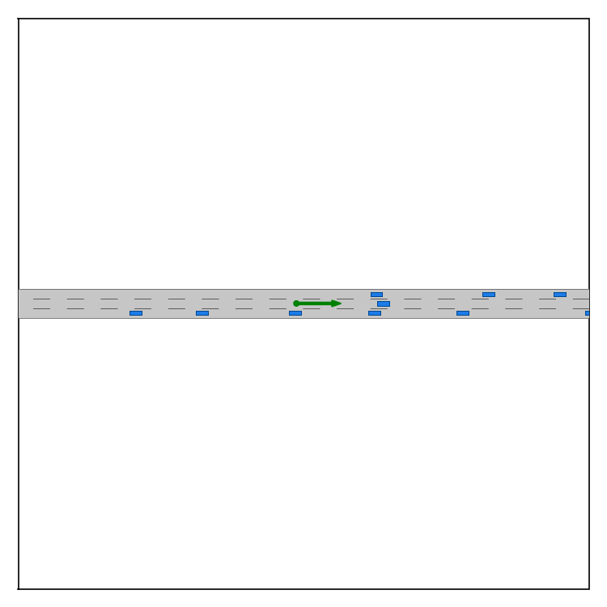
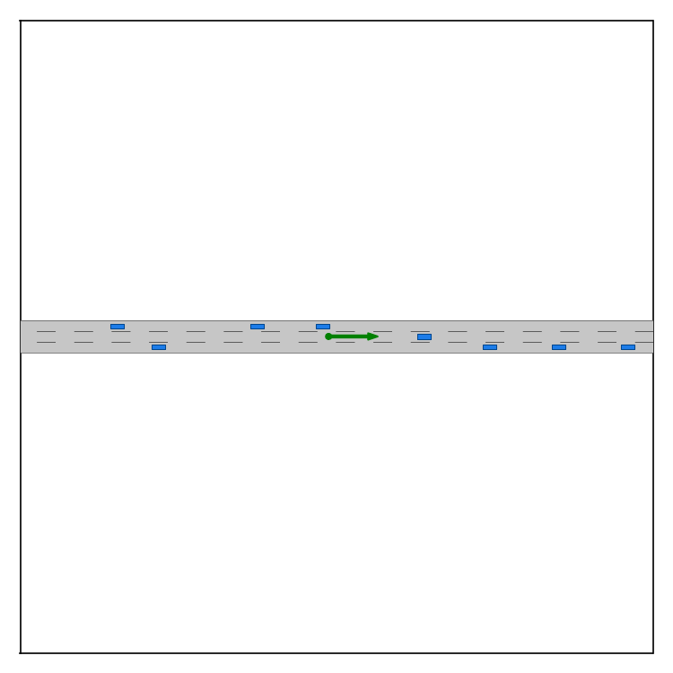
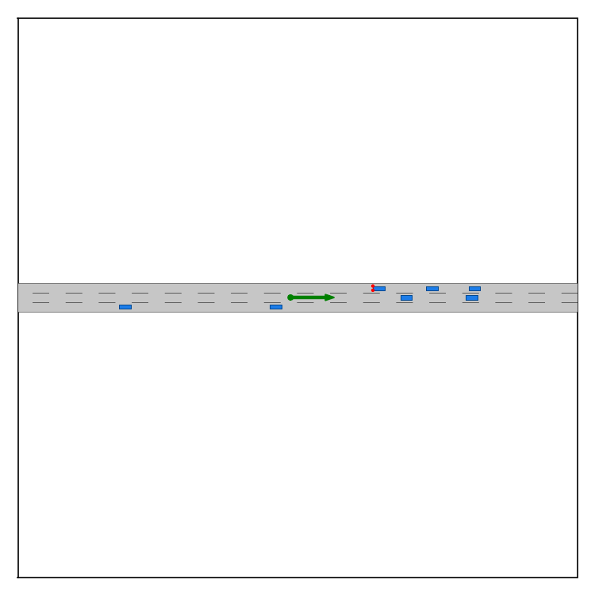

# Visualization

Basic visualization functions are provided in the `render_video` function under the `commonroad_sumo_env.py`, and videos of crashes are automatically saved in `results/saved_data/videos` after testing. 

To generate your own visualization from the saved data, you can also run 
```bash
python NADE_result_analysis.py --root_folder <path-to-your-result-folder> --visualize_flag
```
Videos will be saved in the folder `root_folder/saved_data/videos`.

The followings are some examples:

- **One crash episode for the base model**

    

- **One crash episode for the provably safe reinforcement learning model**

    

- **One crash episode for the base model with SafeDriver** 

    

<- Last Page: [Evaluation](evaluation.md)